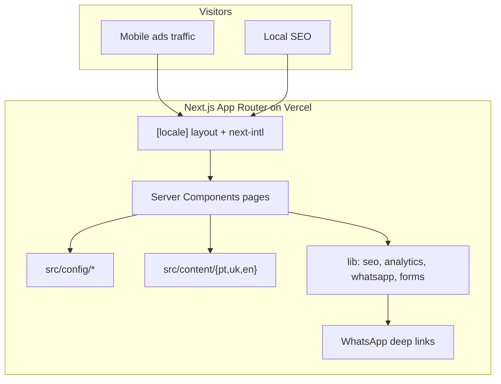

# Car Diagnostics MVP — Implementation Documentation

**Page copy (PT / UK / EN):** see [CONTENT.md](./CONTENT.md) — source of truth for marketing text, metadata, FAQ answers, and form labels before implementation.

## 1. Current Project Assessment

**Repository state:** Empty greenfield. Only [README.md](README.md) (title stub), [LICENSE](LICENSE), [.gitignore](.gitignore) (already Next.js-oriented), and the brief. No `package.json`, no `src/`, no app code.

**Implication:** Scaffold Next.js from scratch; nothing to adapt or migrate.

**Brief alignment:** Lead generation / demand validation site for one-person mobile diagnostics based in Vila Praia de Âncora. Three locales, local SEO, WhatsApp + short form, no backend platform features.

### Ambiguities resolved with defaults (config/TODO where business-owned)

| Topic | Decision for MVP |
|---|---|
| Business name, phone, WhatsApp, email, coords, hours | Placeholders in `src/config/*`; fill before launch |
| Contact form backend | **WhatsApp-first:** form builds a prefilled `wa.me` message via a single submit abstraction; no DB, no email provider required for launch |
| FAQ | Home FAQ section **and** dedicated `/[locale]/faq/` page (SEO + DoD) |
| Blog | Route stubs / types only — **no posts at launch** |
| Pricing copy | Central `pricing.ts`; “from €X” + disclaimer |
| Default locale | `pt` with always-prefixed URLs (`/pt/`, `/uk/`, `/en/`) |
| URL path segments | **Shared English slugs** across locales (e.g. `/pt/services`); language versions linked via `hreflang` / `alternates.languages` — not translated pathnames |
| UI kit | **shadcn/ui** (Radix + Tailwind) for primitives; themed to project tokens |
| Form email later | `submitDiagnosticRequest` interface so Resend/API can replace WhatsApp redirect without UI rewrite |

### Risks (non-blocking)

- **Capability claims:** Copy must stay equipment/vehicle-conditional; SEO must not invent service inventory.
- **Local SEO without GBP data:** No fake reviews/hours/address in JSON-LD; only real config fields.
- **Thin i18n:** Mechanical PT→UK/EN translation will hurt trust; content files must be native-quality European Portuguese.
- **Mobile ads traffic:** Sticky dual CTA must not hurt CLS or cover form fields.
- **Empty brand assets:** Use CSS atmosphere + optional placeholder imagery; real photos later.

### Business decisions required before production launch (not before coding)

- Legal/display business name
- WhatsApp number (E.164)
- Public phone / email (if any)
- Whether to publish address / geo coordinates / opening hours
- Google Analytics 4 measurement ID + Search Console property
- Final “from” prices confirmation

---

## 2. Recommended Architecture



**Stack (locked):**

- Next.js (App Router) + TypeScript + Tailwind CSS + `next-intl` + **shadcn/ui**
- Server Components by default; Client Components only for language switcher, mobile sticky CTA, form interactivity, analytics hooks
- Deploy: Vercel
- No database, auth, CMS, or admin
- **Routing:** `/[locale]/services` style — same path after locale for all languages; SEO via hreflang, not translated slugs

**Content model:** Typed TypeScript dictionaries per locale under `src/content/`, plus shared non-copy data in `src/config/`. UI components receive strings/props — no hardcoded marketing copy in JSX.

**Conversion model:** Primary CTA → contact/book flow; secondary → WhatsApp. Form submission = validated client/server shape → `createWhatsAppLink(prefilled)` (MVP). Same module later can POST to an API.

---

## 3. Module Implementation Plan

Implement **strictly module-by-module**. After each major module: `tsc` / lint / build / spot-check localized routes. Do not advance while broken.

### Module 1 — Project foundation

**Objective:** Bootstrappable Next.js app with TypeScript, Tailwind, ESLint, env example, path aliases.

**Create:**
- `package.json`, `tsconfig.json`, `next.config.ts`, `postcss.config.mjs`, `tailwind.config.ts` (or CSS `@theme`), `eslint.config.mjs`
- `src/app/layout.tsx` (root shell), `src/app/globals.css`
- `.env.example` (`NEXT_PUBLIC_SITE_URL`, `NEXT_PUBLIC_GA_MEASUREMENT_ID`, WhatsApp-related public config mirrored from code or env)
- Update [README.md](README.md) with setup/run/deploy

**Deps to add:** `next`, `react`, `react-dom`, `next-intl`, `typescript`, `tailwindcss`, `@tailwindcss/postcss`, `eslint`, `eslint-config-next`, `zod` for form validation; then init **shadcn/ui** (`components.json`, Radix peers as pulled by CLI).

**SEO/test:** Production `next build` succeeds; `/` redirects into default locale strategy.

---

### Module 2 — Internationalization

**Objective:** `pt` | `uk` | `en` with **shared path segments**, locale prefix only, and correct hreflang/canonical alternates.

**Why not translated slugs:** Localized pathnames (`/pt/servicos` vs `/en/services`) are optional UX/SEO polish. Google’s language targeting is driven by `hreflang` + content language, not by translating the URL path. Shared slugs are simpler for MVP (no `pathnames` map, simpler sitemap/nav/tests) and still fully valid multilingual SEO.

**Create:**
- `src/i18n/routing.ts` — locales, `defaultLocale: 'pt'`, `localePrefix: 'always'` (no localized pathname map)
- `src/i18n/request.ts` — `next-intl` request config
- `src/middleware.ts` — locale negotiation
- `src/app/[locale]/layout.tsx` — `lang`, messages provider, shared chrome
- Message/content loaders for UI chrome (nav, CTAs, a11y strings)

**Shared pathnames (locked):**

| Page | URLs (identical path after locale) |
|---|---|
| home | `/pt`, `/uk`, `/en` |
| services | `/pt/services`, `/uk/services`, `/en/services` |
| pricing | `/pt/pricing`, `/uk/pricing`, `/en/pricing` |
| service-area | `/pt/service-area`, `/uk/service-area`, `/en/service-area` |
| about | `/pt/about`, `/uk/about`, `/en/about` |
| contact | `/pt/contact`, `/uk/contact`, `/en/contact` |
| faq | `/pt/faq`, `/uk/faq`, `/en/faq` |
| blog (stub) | `/pt/blog`, `/uk/blog`, `/en/blog` |

**SEO (hreflang versioning):**
- Each page `generateMetadata` sets `alternates.canonical` to the current locale URL
- `alternates.languages` maps `pt` / `uk` / `en` (+ `x-default` → `pt`) to the sibling URLs with the **same path**
- Visible UI copy, titles, descriptions, and `lang` differ per locale; only the slug stays shared
- Sitemap lists all three locale URLs per page

**Test:** All 7×3 public routes resolve; language switcher keeps the same path under a new locale prefix; view-source shows correct hreflang set.

---

### Module 3 — Design system (shadcn + brand tokens)

**Objective:** Credible local-service visual system (automotive / technical / trustworthy) without racing chrome or “AI startup” look, built on **shadcn/ui**.

**Locked visual direction:**
- **Mode:** Light-first (trust for local service)
- **Palette:** Map project tokens onto shadcn CSS variables (`--background`, `--foreground`, `--primary`, `--accent`, etc.) — cool steel neutrals, deep workshop blue primary, amber/signal accent for WhatsApp/CTA emphasis — not purple, not cream/serif terracotta, not dark-glow
- **Type:** Distinctive pair via `next/font` — e.g. **Sora** (headings) + **Manrope** (body); monospace sparingly for prices/codes
- **Atmosphere:** Subtle technical grid or soft radial wash in hero — not flat white; real workshop photo later as full-bleed hero plane
- **Motion:** 2–3 intentional effects only (hero fade/slide, CTA hover, sticky bar entrance) — no heavy animation libs beyond what shadcn/Radix needs

**Create / add via shadcn CLI (as needed):** `button`, `input`, `label`, `textarea`, `select`, `accordion` (FAQ), `sheet` or `navigation-menu` (mobile nav), `separator`, `card` sparingly. Custom layout primitives: `Container`, `Section`, `Heading` beside shadcn under `src/components/ui/`.

**Usage rule:** Prefer shadcn primitives for interactive/form/a11y-heavy UI; keep marketing sections as custom composition (not a card dashboard). Theme shadcn to brand tokens in `globals.css` — do not keep default shadcn look unchanged.

**A11y:** Focus rings, contrast ≥ WCAG AA for text/CTA (shadcn/Radix baselines + token contrast check).

---

### Module 4 — Layout / navigation

**Objective:** Shared header, footer, mobile nav, sticky mobile CTA.

**Create:**
- `src/components/layout/Header.tsx`, `Footer.tsx`, `MobileNav.tsx`
- `src/components/navigation/LocaleSwitcher.tsx` (client)
- `src/components/navigation/StickyMobileCta.tsx` — `WhatsApp | Book` (client; hide when contact form focused if needed)
- Wire into `[locale]/layout.tsx`

**Config-driven:** Nav labels from messages; WhatsApp from `contact.ts`.

**UX:** Large tap targets; no popups/modals for CTAs.

---

### Module 5 — Central configuration

**Objective:** Single place to change business facts without touching UI.

**Create:**
- `src/config/site.ts` — name, tagline keys, `siteUrl`, locale defaults
- `src/config/contact.ts` — phone, WhatsApp E.164, email
- `src/config/pricing.ts` — priced items with `fromAmount` + currency EUR
- `src/config/services.ts` — service ids referenced by content
- `src/config/locations.ts` — Alto Minho towns list
- `src/config/seo.ts` — default OG image path, twitter card defaults
- `src/types/` — shared types for config + content

**Rule:** Components never hardcode € amounts or phone numbers.

---

### Module 6 — Home page

**Objective:** Primary conversion landing with all brief sections.

**Create:** `src/app/[locale]/page.tsx` + section components under `src/components/home/` (or domain folders): Hero, ValueProp, ServicesTeaser, CommonProblems, HowItWorks, ServiceAreaTeaser, PricingTeaser, WhyUs, FaqTeaser, FinalCta.

**Hero must answer:** what / where / from-price / how to contact — brand-forward, one CTA group, no stat strips or fake badges.

**Content:** `src/content/{pt,uk,en}/home.ts`

**SEO:** Strong local title/description per locale; FAQPage JSON-LD if FAQ present on page.

---

### Module 7 — Services

**Objective:** Full services page with capability disclaimer.

**Routes:** `/[locale]/services` (shared slug).

**Content covers:** computer, engine/CEL, ABS, airbag/SRS, transmission, electrical, live data, fault codes, pre-purchase, mobile — each with honest scope + shared disclaimer: capabilities depend on make/model/year/equipment.

**SEO:** Service-oriented titles; Service JSON-LD from config ids (no invented offers).

---

### Module 8 — Pricing

**Objective:** Clear “from” pricing from `pricing.ts`.

**Defaults:** Basic €30, Full €45, Mobile €50, Pre-purchase €70 + disclaimer on vehicle/location/complexity.

**Analytics:** fire `pricing_view` on section/page view via abstraction.

---

### Module 9 — Service area

**Objective:** One page for Alto Minho coverage — **not** per-city doorway pages.

**Towns:** Vila Praia de Âncora, Caminha, Viana do Castelo, Vila Nova de Cerveira, Valença, Ponte de Lima + surrounding areas; note schedule/distance limits.

**Analytics:** `service_area_view`.

---

### Module 10 — About

**Objective:** Trust page — solo operator, Âncora base, multilingual communication, transparent diagnostics; no “best/expert/#1” claims.

---

### Module 11 — Contact / lead generation

**Objective:** WhatsApp-primary contact + short diagnostic request form.

**Create:**
- `src/lib/whatsapp/createWhatsAppLink.ts`
- `src/lib/forms/diagnosticRequest.ts` — schema (zod), `submitDiagnosticRequest` → WhatsApp URL for MVP
- `src/components/contact/DiagnosticRequestForm.tsx` (client)
- `src/app/[locale]/contact/page.tsx`

**Fields:** name, phone/WhatsApp, make, model, year, engine (opt), problem, location, preferred datetime (opt). Honeypot field for basic spam deterrence.

**Events:** `contact_form_start`, `contact_form_submit`, `whatsapp_click`, `phone_click`.

---

### Module 12 — FAQ

**Objective:** Answer demand questions without overpromising.

**Home section +** `src/app/[locale]/faq/page.tsx` with full set from brief (computer diagnostics, ABS, SRS, AT, mobile visit, pricing, workshop vs on-site, clearing codes, pre-purchase, brands).

**SEO:** FAQPage JSON-LD on FAQ page (and optionally home if duplicated carefully — prefer one canonical FAQPage on `/faq` to avoid duplication).

---

### Module 13 — SEO metadata, sitemap, robots

**Create:**
- `src/lib/seo/buildMetadata.ts` — title, description, canonical, OG, alternates
- Per-page `generateMetadata`
- `src/app/sitemap.ts` — all locale×page URLs, no query/duplicates
- `src/app/robots.ts` — allow public; disallow internals if any
- Optional `src/app/[locale]/opengraph-image` later; start with static OG in `/public`

**Title patterns (refine in content files):** PT local service + area; UK Portugal/Alto Minho; EN Northern Portugal.

---

### Module 14 — Structured data (JSON-LD)

**Create:** `src/lib/seo/jsonLd.ts` + `<JsonLd />` server component.

**Emit only real data:**
- `WebSite`
- `AutomotiveBusiness` or `LocalBusiness` (prefer AutomotiveBusiness if category fits; final type chosen at implement time from Schema.org — **business decision** if tax/category differs)
- `Service` list from config
- `BreadcrumbList` on inner pages
- `FAQPage` on FAQ
- **Never:** AggregateRating, review count, fake hours/address

---

### Module 15 — Analytics

**Create:** `src/lib/analytics/` — `track(event, payload)`, GA4 loader gated by env, no-op when unset.

**Events:** `whatsapp_click`, `contact_form_start`, `contact_form_submit`, `phone_click`, `pricing_view`, `service_area_view`.

**IDs:** `NEXT_PUBLIC_GA_MEASUREMENT_ID` only. Prepare GSC via domain verification after deploy (docs in README) — no code dependency.

---

### Module 16 — Performance

**Practices:** RSC default; `next/image`; font subsetting; minimal client JS; no animation libraries; lazy below-fold where useful.

**Targets:** Lighthouse Performance ≥90, SEO ≥95, A11y ≥90 on mobile.

---

### Module 17 — Accessibility

Semantic landmarks, one `h1` per page, labeled inputs, keyboard nav/mobile menu, focus visible, meaningful alt / empty alt for decorative.

---

### Module 18 — Testing

**MVP test plan:**
- `npm run lint` + `tsc --noEmit` + `next build` in CI-friendly scripts
- Manual checklist: 3 locales × core pages, hreflang/canonical view-source, WhatsApp link opens with prefills, sticky CTA, form validation, sitemap/robots fetch
- Optional later: Playwright smoke for locale routes (not required for first launch unless time allows)

---

### Module 19 — Deployment

- Vercel project from GitHub
- Env: `NEXT_PUBLIC_SITE_URL`, `NEXT_PUBLIC_GA_MEASUREMENT_ID`
- Custom domain + HTTPS
- Submit sitemap to Search Console; create Google Business Profile offline (process doc in README)
- Preview deployments per PR

---

## 4. Target File Tree (file-by-file)

```text
src/
  app/
    layout.tsx
    globals.css
    sitemap.ts
    robots.ts
    [locale]/
      layout.tsx
      page.tsx
      services/page.tsx
      pricing/page.tsx
      service-area/page.tsx
      about/page.tsx
      contact/page.tsx
      faq/page.tsx
      blog/page.tsx            # stub until content exists
  components/
    layout/ Header Footer MobileNav
    navigation/ LocaleSwitcher StickyMobileCta
    hero/ Hero
    services/ ServiceList ServiceDisclaimer
    pricing/ PricingTable
    service-area/ AreaMapList
    faq/ FaqList
    contact/ DiagnosticRequestForm WhatsAppButton
    seo/ JsonLd
    ui/                  # shadcn-generated + Container/Section/Heading
  config/ site contact pricing services locations seo
  content/ pt|uk|en / home services pricing serviceArea about contact faq common
  i18n/ routing request
  lib/ analytics/ seo/ whatsapp/ forms/
  types/
middleware.ts
components.json              # shadcn
public/ (favicon, og-default, optional images)
docs/IMPLEMENTATION.md
```

**Note on routes:** Filesystem folders match public path segments (`services`, `pricing`, …). Locale is only the `[locale]` prefix. Multilingual discovery is via hreflang / `alternates.languages`, not translated URLs.

---

## 5. Dependencies

**Add:** `next`, `react`, `react-dom`, `next-intl`, `zod`, Tailwind, TypeScript, ESLint, **shadcn/ui** stack (`class-variance-authority`, `clsx`, `tailwind-merge`, `lucide-react`, Radix packages as added by `npx shadcn@latest add …`).

**Do not add:** Prisma/DB, auth libs, CMS SDKs, heavy alternative UI kits (MUI/Chakra), animation frameworks, map SDKs, chatbot SDKs, i18n CMS, `next-intl` pathname localization maps.

---

## 6. SEO Implementation Plan

1. Unique metadata per locale×page via `buildMetadata`
2. `alternates.canonical` + `alternates.languages` (hreflang) with **shared paths** — e.g. `/pt/services` ↔ `/uk/services` ↔ `/en/services`, `x-default` → `/pt/...`
3. `sitemap.ts` enumerating all indexable locale×page URLs
4. `robots.ts` allow-all public
5. JSON-LD as in Module 14
6. On-page: one clear H1, local entities in natural prose (Âncora, Alto Minho, Viana…), internal links Home↔Services↔Pricing↔Area↔Contact
7. **No** city microsites; **no** thin blog at launch; **no** translated URL slugs in MVP
8. Keyword themes from brief used as guidance for titles/H1s — not stuffed body copy (URL keywords are secondary to title/H1/body)

---

## 7. Internationalization Plan

- `next-intl` + always prefix + **identical path segments** per page
- European Portuguese only in `pt` content
- Native UK/EN copy in separate files (not auto-translated strings in UI)
- Locale switcher swaps `/pt/services` → `/uk/services` (same path, new locale)
- Date/number formatting via `next-intl` formatters where shown
- `lang` attribute on `[locale]` layout
- Hreflang is the mechanism that tells search engines these are language versions of the same page

---

## 8. Analytics Plan

- GA4 script only if measurement ID set
- Central `track()`; components call named helpers (`trackWhatsAppClick`, etc.)
- Conversion funnel for validation: page views by locale → CTA clicks → form start/submit → (offline) paid job

---

## 9. Testing Plan

| Gate | When |
|---|---|
| lint + typecheck | every module |
| production build | every module |
| locale route matrix | after i18n + each page module |
| metadata/hreflang/sitemap/robots | after SEO module |
| WhatsApp + form | after contact module |
| Lighthouse mobile | before launch |
| Manual a11y pass | before launch |

---

## 10. Deployment Plan

1. Push repo → Vercel
2. Set env vars + production domain
3. Verify `/pt`, `/uk`, `/en`, sitemap, robots
4. GA4 realtime check on WhatsApp click
5. Search Console property + sitemap submit
6. GBP setup (external checklist in README)

---

## 11. MVP vs Future

**MVP in scope:** modules 1–19 as above (blog stub only).

**Explicitly out of scope:** auth, admin, DB, payments, booking calendar, CRM, PDF reports, ECU coding catalog, per-city SEO pages, AI chatbot, multilingual CMS, dozens of blog posts.

**Extension seams:** `submitDiagnosticRequest`, `config/services.ts`, empty `blog/[slug]` architecture, analytics event names stable for later funnels.

---

## 12. Implementation Sequence (after approval)

1. Persist this doc as `docs/IMPLEMENTATION.md`
2. Scaffold Next.js foundation + Tailwind + config skeleton
3. i18n + layout shell
4. Design tokens + UI primitives
5. Home (full sections)
6. Services → Pricing → Service area → About → FAQ → Contact
7. SEO + JSON-LD + sitemap/robots
8. Analytics + sticky CTA polish
9. A11y/perf pass + Lighthouse
10. Vercel deploy + env + launch checklist

---

## Status

This document is the implementation specification for review.

**Do not start application code until this document has been checked and explicitly approved for build.**

When build starts, follow the sequence in section 12 module-by-module.
